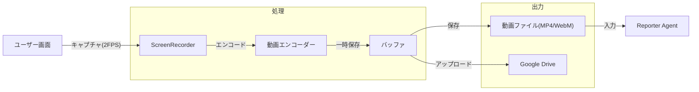

# ScreenRecorder 入出力

## フロー

```mermaid
graph LR
    UserScreen["ユーザー画面"] -->|"キャプチャ(2FPS)"| Recorder["ScreenRecorder"]
    
    subgraph Process ["処理"]
        Recorder -->|"エンコード"| VideoEncoder["動画エンコーダー"]
        VideoEncoder -->|"一時保存"| Buffer["バッファ"]
    end

    subgraph Outputs ["出力"]
        Buffer -->|"保存"| VideoFiles["動画ファイル(MP4/WebM)"]
        Buffer -->|"アップロード"| CloudStorage["Google Drive"]
    end

    VideoFiles -->|"入力"| Reporter["Reporter Agent"]
```

## データ仕様

*   **入力**: 全画面/ウィンドウキャプチャ
*   **パラメータ**: 2FPS (容量節約)
*   **出力**: 分割された動画ファイル (ローカル/クラウド)
