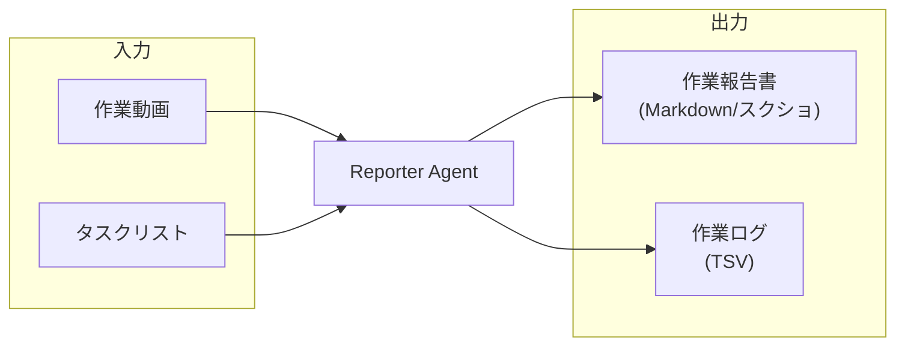

# 作業報告エージェント 入出力

## フロー



## 目標

### WordReportAgentでの目標

1. オフィス仕事の作業者たちに共通したボトルネックとなる作業は何かをまず見つけること
2. オフィス仕事の作業者たちの手法の中で、最も効率的な手法を見つけ出し、それを作業者全体に共有すること

### オフィス仕事自動化プロジェクトでの最終目標

WordReportAgentでの目標での1,2を元に、

- 最終的にはその改善案を作業者に教えてあげる。
    - 別プロジェクトのコーディングエージェントにやってもらうようにする
- OSを操作するAIに全ての作業をやってもらい、人間はただそれを評価するだけの状態にすること


## データ仕様

*   **入力**: 2FPS作業動画、タスクリスト、ユーザー指示
*   **処理**: Geminiによる映像解析、タスクマッピング
*   **出力**:
    *   作業報告書(Markdown/スクショ付)
    *   **作業ログ(TSV)**: `アプリ名	開始時刻	終了時刻	作業タイトル	作業タグ	作業手順(Markdown)	スクショ時刻`

### TSV出力例

```tsv
Rhino	14:00	15:30	住宅モデリング(1F)	Design,3D	- フロアプランのインポート\n- 壁・柱の立ち上げ\n- 開口部の調整	15:15
Chrome	15:30	15:45	建材リサーチ	Research	- 外壁材のテクスチャ検索\n- カタログダウンロード	15:40
Rhino	15:45	16:30	レンダリング設定	Visualization	- 太陽光設定\n- マテリアル適用	16:10
```

時間のかかる作業順に並べておく。