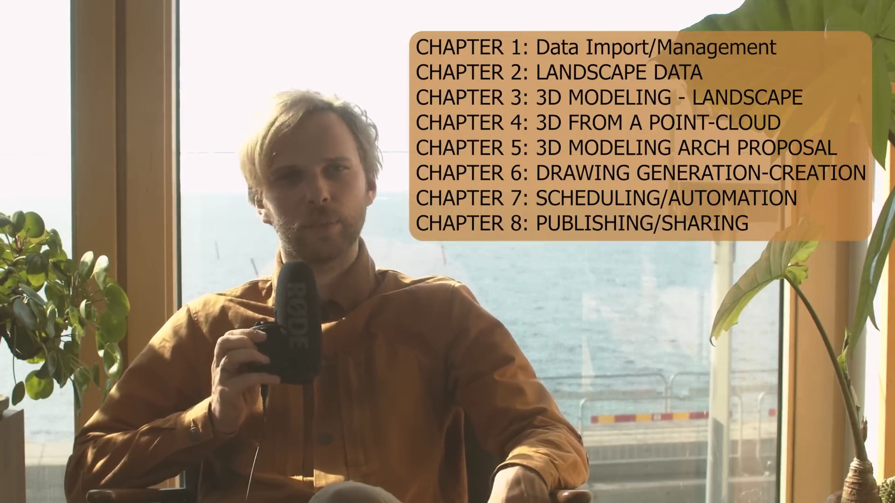
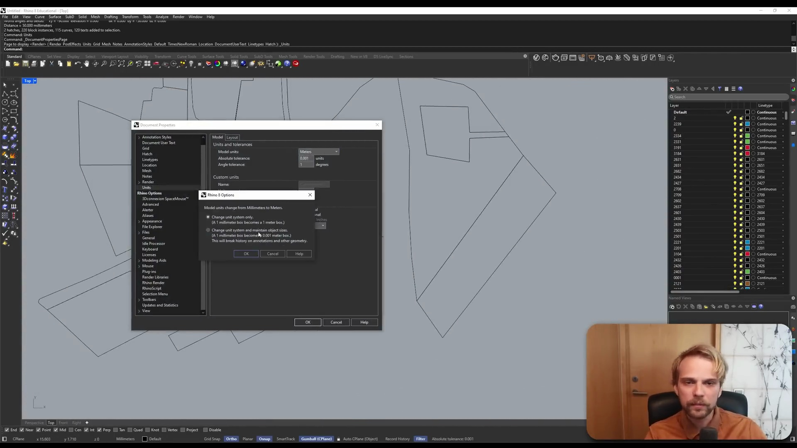
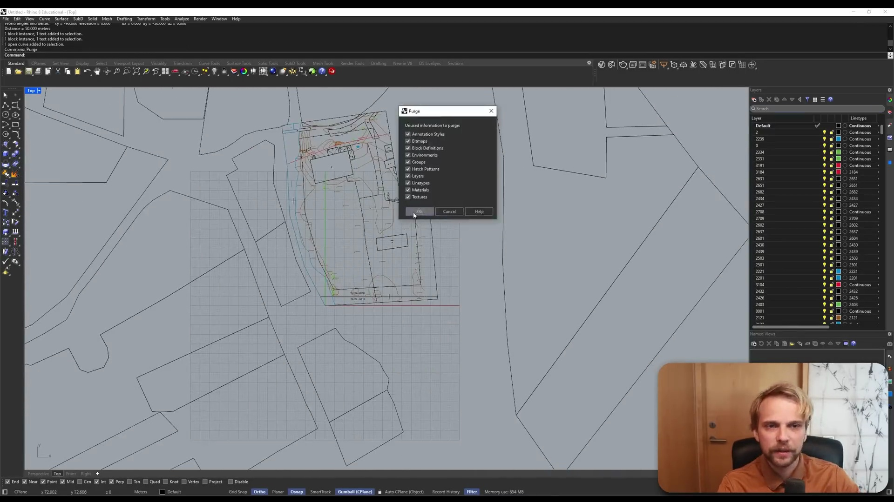
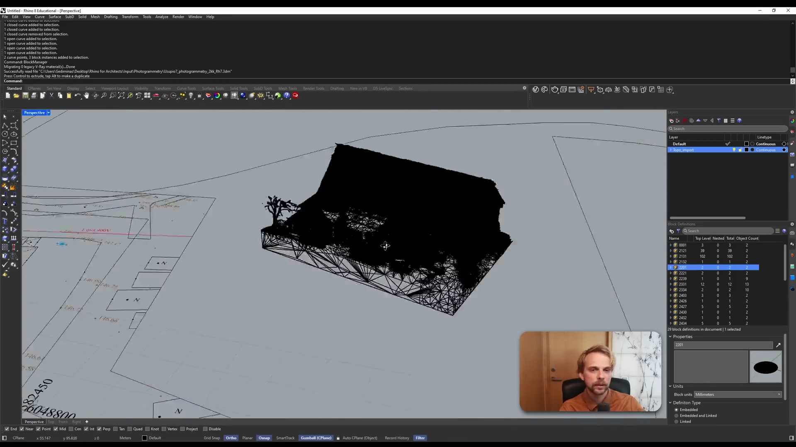
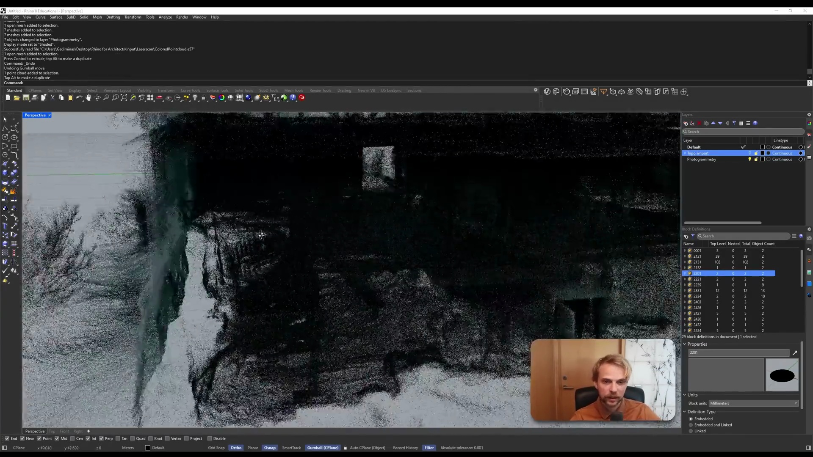
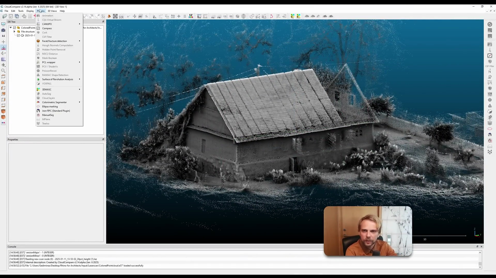
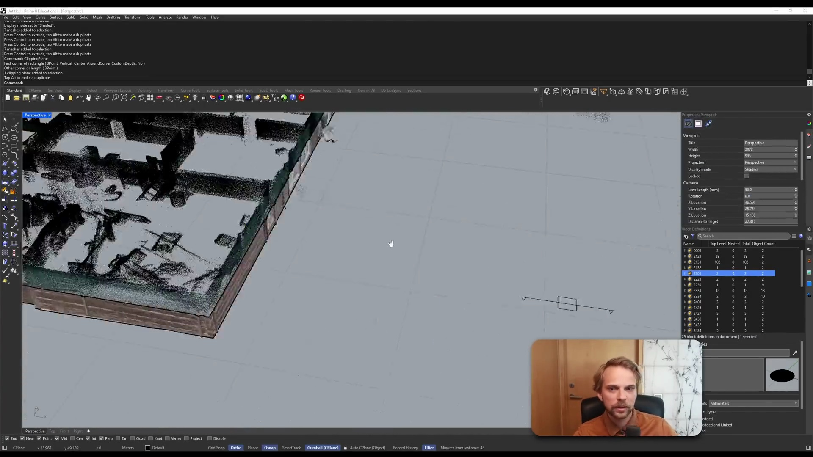

# Rhinoを活用した建築設計データ統合・管理ワークフロー

## 概要
AIによる自動生成レポートです。詳細な手順と分析を含みます。

## イントロダクションとコース概要 (00:00 - 00:10)

### イントロダクションとコース概要

このセクションでは、コースの目的と全体像が説明されます。高価なBIMソフトウェア（例：ArchiCAD）の代替として、RhinoとVisualARQを組み合わせた、より手頃で柔軟な建築設計ワークフローを学ぶことが本コースの主題であることが示唆されます。

- **コースの背景と目的の提示**
  - **比較対象の提示**:
    - `00:01` Graphisoft社のArchiCADの価格ページを画面に表示し、従来のBIMソフトウェアが高価であるという文脈を設定。
  - **代替案の提示**:
    - `00:03` RhinoのプラグインであるVisualARQのウェブサイトを表示。
    - `00:04` VisualARQの価格ページを提示し、ArchiCADと比較してコストパフォーマンスに優れる選択肢であることを示唆。
- **コース全体の構成紹介**
  - `00:06` データインポートから最終的な共有まで、建築設計の一連のプロセスを網羅する全8章のカリキュラムを画面に表示。
    - CHAPTER 1: Data Import/Management
    - CHAPTER 2: LANDSCAPE DATA
    - CHAPTER 3: 3D MODELING - LANDSCAPE
    - CHAPTER 4: 3D FROM A POINT-CLOUD
    - CHAPTER 5: 3D MODELING ARCH PROPOSAL
    - CHAPTER 6: DRAWING GENERATION-CREATION
    - CHAPTER 7: SCHEDULING/AUTOMATION
    - CHAPTER 8: PUBLISHING/SHARING

### 評価

- **効率的な点**
  - **価値提案の明確化**: 冒頭で高価なソフトウェアとの価格比較を行うことで、このコースが提案するワークフローの「コスト効率」という利点が明確に伝わります。
  - **学習ロードマップの提示**: 最初にコース全体の章立てを一覧で示すことにより、学習者はこれから何をどのような順序で学ぶのかを把握できます。これにより、学習の見通しが立てやすくなり、モチベーションの維持にも繋がります。
- **ボトルネック**
  - このセクションはイントロダクションであり、具体的な操作は含まれていないため、作業上のボトルネックは特にありません。

---

## DWG地形図データのインポートと単位設定 (00:11 - 00:50)

はい、承知いたしました。
動画の 00:11 から 00:50 までの範囲について、「DWG地形図データのインポートと単位設定」という見出しで詳細な作業ログを以下に記述します。

***

### DWG地形図データのインポートと単位設定

このセクションでは、プロジェクトの基礎となる地形図データ（DWG形式）をRhinoにインポートし、モデル空間の単位を実際の測量データに合わせてメートルに設定する手順を解説しています。

#### 具体的な操作手順

- **参照画像のインポートと確認（準備段階）**
    - `00:17`：まず、参考となる現地の写真（`.jpg`）をビューポートにドラッグ＆ドロップし、`Image Options`ダイアログで`Picture`を選択して配置。プロジェクトのコンテキストを視覚的に把握します。
    - `00:28`：確認後、参照画像は削除します。

- **DWGファイルのインポート**
    - `00:29`：地形図のDWGファイルをファイルエクスプローラーからRhinoのビューポートへ直接ドラッグ＆ドロップします。
    - `00:30`：表示されたダイアログで`Import file`を選択します。
    - `00:31`：`DWG/DXF Import Options`ダイアログが表示されます。ここでは、DWGファイルに設定されていた単位である `Millimeters` のままインポートを実行します。

- **インポートデータの確認と単位の検証**
    - `00:33`：インポート直後はオブジェクトが小さく表示されるため、`Zoom`コマンドの`Extents`オプションを実行し、インポートされた全てのオブジェクトを画面全体に表示させます。
    - `00:35`：インポートされたデータには、敷地の境界線、建物の外形、等高線、測量ポイントなどが含まれていることを確認します。
    - `00:41`：データ内の座標値（例: `6048800`）や標高を示す数値（例: `146.xx`）を確認。これらの数値は明らかにメートル単位を基準としているため、現在のドキュメント設定（ミリメートル）との不整合が判明します。

- **ドキュメントの単位設定変更**
    - `00:44`：メニューバーの`File` > `Properties`（またはコマンド`DocumentProperties`）を開き、`Units`タブを選択します。
    - `00:45`：`Model units`の設定を `Millimeters` から `Meters` に変更します。
    - この操作により、モデル内のジオメトリを新しい単位に合わせてスケーリングするかを問う警告ダイアログが表示されます。
    - 
    - `00:46`：ここで「はい(Y)」を選択します。これにより、全てのモデルジオメトリが自動的に1/1000にスケーリングされ、寸法がメートル単位に補正されます。

#### ボトルネックと効率的な点

- **ボトルネック**
    - **単位の不整合**: DWGファイルを作成した際の単位（この場合はミリメートル）と、データが持つ実際の地理的意味（メートル）が異なっているため、インポート後に手動で単位設定を修正する必要がありました。これは外部データを利用する際によく発生する問題であり、データの出自と単位系を事前に確認することが重要です。
    - **不要なデータ**: インポートされたDWGデータには、非常に多くのレイヤーが含まれていました。後の作業効率を上げるためには、不要なレイヤーやブロック定義を`Purge`コマンドなどで整理する作業が必要になる可能性があります。

- **効率的な点**
    - **ドラッグ＆ドロップによるインポート**: ファイルを直接ビューポートにドラッグ＆ドロップするだけでインポートできるため、操作が直感的かつ迅速です。
    - **単位変更時の自動スケーリング機能**: Rhinoには、ドキュメントの単位を変更する際に、既存のモデルを自動でスケール調整する機能が備わっています。この機能を使ったことで、手動で`Scale`コマンドを実行して計算する手間が省け、非常に効率的に正しいスケールに修正できました。

---

## インポートデータのクリーンアップと整理 (00:51 - 01:04)

はい、承知いたしました。
動画の 00:51 から 01:04 までの範囲について、「インポートデータのクリーンアップと整理」という見出しで、要件に基づいた詳細な作業ログを作成します。

---

### インポートデータのクリーンアップと整理

インポートした地形データ（DWG/DXF形式）には、3Dモデリングに直接関係のない多くの未使用データや、2D図面用のブロックシンボルが含まれています。このセクションでは、これらの不要な要素を削除し、作業しやすいようにデータを整理する手順を示します。

#### 具体的な操作ログ

*   **1. 未使用データの一括削除 (Purge)**
    *   **使用ツール**: `Purge` コマンド
    *   **操作内容**: コマンドラインに `Purge` と入力し、コマンドを実行します。ダイアログが表示された場合は、削除対象（ブロック定義、レイヤー、寸法スタイル等）を選択し、すべて削除します。
    *   **目的**: ファイル内に存在するものの、実際には使用されていない要素（ブロック定義、レイヤー、線種、マテリアルなど）を一括で削除し、ファイルサイズを軽量化し、管理を容易にします。
    *   **結果**: コマンド履歴に表示されている通り、233個のブロック定義を含む多数の未使用データが削除されました。
    

*   **2. レイヤーの整理**
    *   **使用ツール**: `Layers` パネル
    *   **操作内容**: 作業に不要と思われる多数のレイヤー（例: `2209` から `3104` まで）の表示アイコン（電球マーク）をクリックし、非表示に設定します。
    *   **目的**: 多数存在するレイヤーの中から、必要な情報（建物の外形線、等高線など）のみを表示させ、ビューポートの視認性を向上させます。

*   **3. 不要なブロックオブジェクトの特定と削除**
    *   **使用ツール**: `BlockManager` コマンド、`Select Objects` 機能
    *   **操作内容**:
        1. `BlockManager` コマンドを実行し、ファイル内に定義されているブロックの一覧を表示します。
        2. 一覧から不要と思われるブロック定義（例: 測量ポイントを示すシンボルなど）を複数選択します。
        3. 選択したブロック定義に対応する全てのオブジェクト（ブロックインスタンス）が、ビューポート上でハイライト表示されるのを確認します。
        4. 内容を確認後、ハイライトされた全てのブロックインスタンスを選択し、`Delete` キーで削除します。
    *   **目的**: 3Dモデリングの妨げとなる、あるいは参照情報として不要な2D図面用のシンボルやオブジェクトをモデル空間から物理的に削除します。

#### 作業のボトルネックと効率的な点

*   **ボトルネック**:
    *   インポートされたデータのレイヤー数が非常に多く、命名規則も不明な場合、どのレイヤーに何のオブジェクトが含まれているかを一つ一つ確認する作業は非常に時間がかかります。一つずつ表示・非表示を切り替えて内容を把握する必要があり、煩雑な作業になりがちです。

*   **効率的な点**:
    *   **`Purge` コマンド**は、ワンクリックで大量の「ゴミデータ」を一掃できるため、クリーンアップ作業の最初のステップとして非常に強力かつ効率的です。
    *   **`BlockManager`** を使用することで、特定の種類のブロックオブジェクトをまとめて選択・確認・削除できます。ビューポート上で直接オブジェクトを選択するよりも、体系的に不要な要素を特定できるため、整理作業の効率が大幅に向上します。

---

## Photogrammetry（写真測量）モデルのインポートと確認 (01:05 - 01:31)

はい、承知いたしました。
動画の 01:05 から 01:31 までの範囲について、「Photogrammetry（写真測量）モデルのインポートと確認」という見出しで、詳細な作業ログをMarkdown形式で作成します。

***

### Photogrammetry（写真測量）モデルのインポートと確認

このセクションでは、写真測量によって生成された3DメッシュモデルをRhinoにインポートし、地形データとの位置関係やモデルの状態を確認します。ドラッグ＆ドロップによる直感的な操作で、テクスチャ付きのモデルを迅速に作業環境へ取り込みます。

#### 作業手順

*   **1. FBXファイルのインポート**
    *   **使用ツール:** Windowsエクスプローラー, Rhino 7
    *   **操作:** エクスプローラーで `Photogrammetry` フォルダを開き、3Dモデルファイル `Group1_Photogrammetry_2k_001.fbx` をRhinoのビューポートへ直接ドラッグ＆ドロップする。
    *   **結果:** インポート処理が実行され、モデルがRhinoの作業空間に配置される。この時、モデルデータは `Photogrammetry` という名前の新しいレイヤーに自動的に格納される。

*   **2. 3Dモデルの表示と確認**
    *   **操作:** `Perspective` ビューに切り替え、マウスでビューを回転・ズームし、モデルを様々な角度から確認する。
    *   **結果:** 写真から生成されたテクスチャが正確にマッピングされた3Dメッシュモデルが正常に表示されることを確認。これにより、建物の外観や周辺の状況を視覚的に把握できる。

    

*   **3. 表示モードによる検証**
    *   **操作:** ビューポートの表示モードを、テクスチャ付きの `Rendered` モードから `Wireframe` モードへ一時的に切り替える。
    *   **目的:** モデルを構成するポリゴンメッシュの密度や構造を確認する。その後、再度 `Rendered` モードに戻し、テクスチャの詳細（ドア周りなど）を拡大して確認する。

*   **4. 関連ファイルの確認**
    *   **使用ツール:** Windowsエクスプローラー
    *   **操作:** FBXファイルが格納されているフォルダ（`2k FBX`）の中身を確認する。
    *   **内容:** モデルのテクスチャとして参照されている複数のJPG画像ファイル（ディフューズマップやノーマルマップ）が格納されていることを確認。FBX形式がこれらの外部ファイルをリンクして表示を構成していることがわかる。

*   **5. レイヤーの整理**
    *   **操作:** 次のレーザースキャンデータのインポート作業に備え、Rhinoのレイヤーパネル上で `Photogrammetry` レイヤーのチェックを外し、非表示にする。

#### 考察

*   **効率的な点:**
    *   Rhinoのドラッグ＆ドロップによるインポート機能は非常に効率的です。ファイル形式を意識することなく、直感的な操作で迅速にデータを追加できます。
    *   FBX形式を用いることで、テクスチャ情報も自動的に読み込まれるため、手動でマテリアルを設定する手間が省け、作業時間を大幅に短縮できます。

*   **潜在的なボトルネック:**
    *   写真測量モデルはデータサイズが大きくなりがちです。高解像度のメッシュやテクスチャを持つモデルの場合、インポートやビューポート上での操作（回転、ズーム）に時間がかかり、PCのスペックによってはパフォーマンスの低下を招く可能性があります。
    *   インポート時にモデルの原点や縮尺が意図したものと異なる場合があります。今回は地形データと大まかに合っているように見えましたが、プロジェクトによっては正確な位置合わせ作業が追加で必要になることがあります。

---

## Laser Scan（点群）データのインポートと比較 (01:32 - 01:42)

はい、承知いたしました。
動画の 01:32 から 01:42 までの範囲について、「Laser Scan（点群）データのインポートと比較」という見出しで詳細な作業ログを作成します。

***

### Laser Scan（点群）データのインポートと比較

このセクションでは、前工程でインポートしたフォトグラメトリのメッシュデータに加え、レーザースキャナーで取得した点群データ（`.e57`形式）をRhinoにインポートし、両者の特性を比較・確認します。

#### 具体的な操作ログ

*   **使用ツール:**
    *   ソフトウェア: Rhinoceros 7
    *   Windows エクスプローラー

*   **点群データのインポート:**
    *   Windows エクスプローラーを開き、プロジェクトフォルダ内の `Input\Laserscan` に格納されている `CanonPointCloud.e57` ファイルを探します。
    *   この `.e57` ファイルを、Rhinoのパースペクティブビューポートへ直接ドラッグ＆ドロップします。
    *   Rhinoが自動的にファイルを認識し、点群データが3D空間にインポートされます。

*   **データの確認と比較:**
    *   インポート直後、ビューを回転・ズームして、点群データの密度、範囲、欠損部などを視覚的に確認します。
    *   フォトグラメトリで生成されたメッシュデータと比較し、レーザースキャンデータの方が建物の周囲の樹木や地形など、より広範囲を捉えていることが分かります。
    *   レイヤー管理パネルで、既存の「Photogrammetry」レイヤーを非表示に切り替えます。
    *   これにより、レーザースキャンによる点群データのみが表示され、データの全体像や詳細をより明確に把握できます。

#### 作業の考察

*   **効率的な点:**
    *   Rhinoのドラッグ＆ドロップによるインポート機能は非常に直感的かつ高速です。`.e57` のような標準的な点群フォーマットであれば、複雑な設定ダイアログを経由することなく、即座にデータを3D空間に取り込めるため、思考を中断させずに作業を続行できます。
    *   レイヤーを活用して異なる種類の3Dデータ（メッシュと点群）の表示・非表示を瞬時に切り替えられるため、両者の特性（フォトグラメトリの色情報や再現性、レーザースキャンの精度や範囲など）を効率的に比較検討できます。

*   **ボトルネックと注意点:**
    *   動画で確認できるように、インポートされた点群データと既存のフォトグラメトリデータは、初期位置が一致していません。この後の工程で、両者の位置と縮尺を正確に合わせる「アライメント」作業が必須となります。
    *   今回インポートした点群データは比較的軽量に見えますが、大規模な点群データはPCのパフォーマンスに大きな負荷をかける可能性があります。実務で扱うデータによっては、Rhinoにインポートする前に、CloudCompareなどの専門ツールで不要な点を削除したり、データを間引いたりする事前処理がボトルネック解消の鍵となります。

---

## CloudCompareによる点群データのノイズ除去 (01:43 - 01:56)

はい、承知いたしました。
動画の 01:43 から 01:56 までの範囲について、「CloudCompareによる点群データのノイズ除去」という見出しで、以下に詳細な作業ログを作成します。

---

### CloudCompareによる点群データのノイズ除去

このセクションでは、レーザースキャンで取得した点群データ（Point Cloud）に含まれる不要なノイズを除去するため、外部のオープンソースソフトウェア「CloudCompare」を使用します。これにより、後工程の3Dモデリング作業をより正確かつ効率的に行うためのクリーンなデータを作成します。

#### 作業ログ

- **使用ツール:**
  - CloudCompare (3D点群・メッシュ処理ソフトウェア)

- **データのインポート:**
  - 01:45: ファイルエクスプローラーからCloudCompareを起動します。
  - 01:46: ノイズが含まれている点群データファイル（`.e57`形式）を、CloudCompareのビューポートにドラッグ＆ドロップして読み込みます。

- **SORフィルターによるノイズ除去:**
  - 01:51: 読み込んだ点群データを選択した状態で、メニューバーから `Tools` > `Clean` > `SOR filter` を選択します。SOR (Statistical Outlier Removal) フィルターは、各点の近傍にある点との距離の平均と標準偏差を計算し、基準から大きく外れた点（外れ値）をノイズとして自動的に除去する機能です。
  
  

  - 01:52: SORフィルターのパラメータ設定ダイアログが表示されますが、動画内では特に設定を変更せず、デフォルト値のまま「OK」をクリックして処理を実行しています。
  - 01:54: フィルター処理が開始され、完了するまで待機します。

- **結果の確認:**
  - 01:55: 処理が完了すると、建物周辺に散らばっていた浮遊点などのノイズが除去され、建築物や地面の形状がより明確になったことが確認できます。

#### 作業のボトルネックと効率性

- **効率的な点:**
  - **ツールの有効性:** CloudCompareはオープンソースで無償でありながら、点群処理のための強力な機能を多数備えています。特にSORフィルターは、数クリックの簡単な操作で効果的に外れ値を除去できるため、非常に効率的です。
  - **直感的な操作:** データをドラッグ＆ドロップで読み込み、メニューからフィルターを選択するだけで基本的なノイズ除去が完了するため、専門的な知識がなくても扱いやすいワークフローです。

- **ボトルネック・注意点:**
  - **ワークフローの分断:** ノイズ除去のためにRhinoから一度CloudCompareにデータを移し、処理後に再度Rhinoに戻すという手間が発生します。Rhino内で完結するプラグインなどがあれば、よりシームレスな作業が可能です。
  - **パラメータ調整の必要性:** 今回はデフォルト設定で良好な結果が得られましたが、点群の密度やノイズの特性によっては、SORフィルターのパラメータ（近傍点の数や標準偏差のしきい値）を適切に調整する必要があります。調整を誤ると、必要なデータまで除去してしまうリスクがあります。

---

## 処理済みデータの統合とクリッピング平面による断面確認 (01:57 - 02:29)

はい、承知いたしました。
動画の 01:57 から 02:29 の区間について、「処理済みデータの統合とクリッピング平面による断面確認」という見出しで、詳細な作業ログを作成します。

***

### 処理済みデータの統合とクリッピング平面による断面確認

このセクションでは、前処理ソフトウェア（CloudCompare）でノイズ除去を行った点群データと、元のフォトグラメトリデータを3Dモデリングソフトウェア（Rhino）上で統合します。その後、Rhinoの強力な可視化ツールである「クリッピング平面（Clipping Plane）」を使用して、建物の内部構造を非破壊的に確認し、モデリングの準備を行います。

#### 具体的な操作ログ

- **データの統合と比較**
    - CloudCompareで処理済みのクリーンな点群データ（色情報なし）をRhinoのワークスペースにインポートします。
    - 参照用として、元のフォトグラメトリデータ（テクスチャ付きメッシュ）をコピーし、インポートした点群データ上に重ね合わせます。
    - Rhinoの`Gumball`ツールを使用し、2つのデータの位置と向きを視覚的に合わせます。これにより、ノイズ除去の効果（不要な植生などが消えていること）を確認します。

- **クリッピング平面による水平断面の確認**
    - `Display`パネルから`Clipping Plane`（クリッピング平面）機能を有効化し、ビューポート上に切断面を作成します。
    - `Gumball`を使い、作成したクリッピング平面をZ軸方向（垂直方向）にドラッグして移動させます。
    - 平面を上下させることで、建物の任意の高さにおける水平断面をリアルタイムで表示し、内部の壁の配置や厚さを確認します。

    （画像挿入）

- **クリッピング平面による屋根構造の確認**
    - 参照用のフォトグラメトリデータを非表示にし、作業対象をクリーンな点群データのみに絞ります。
    - 新たにクリッピング平面を作成し、`Gumball`の回転ハンドルを使用して、屋根の勾配に合わせて平面を傾けます。
    - 傾けた平面を移動させることで、屋根裏の梁や小屋組といった、通常は見えない構造部材の配置を断面で確認します。

#### 作業のボトルネックと効率的な点

- **ボトルネック**
    - `Gumball`による手動での位置合わせは直感的ですが、厳密な座標基準がない場合、完全な一致は難しく、試行錯誤に時間がかかる可能性があります。

- **効率的な点**
    - **クリッピング平面の活用**: 3Dデータを実際に切断することなく、内部構造をインタラクティブに確認できる点は非常に効率的です。`Gumball`と組み合わせることで、任意の角度・位置の断面を即座に表示でき、複雑な形状の把握やモデリング方針の決定に大きく貢献します。
    - **複数データの重ね合わせ**: 処理済みの点群と元のフォトグラメトリデータを重ねることで、どの部分のデータがクリーンアップされたかを視覚的に明確に把握でき、作業の妥当性を確認しやすくなっています。

---
